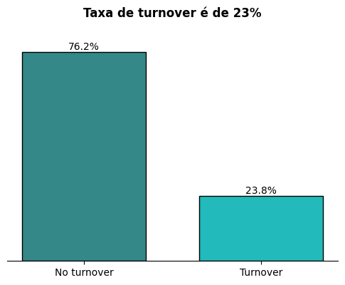

<h1 align="center">ANÁLISE DE TURNOVER</h1>

    
    
  

<h2>O que é taxa de rotatividade? 👥</h2>

A taxa de rotatividade, ou também conhecida como taxa de turnover refere-se a quantidade de funcionário que saem ou são demitidos dentro de um empresa em um determinado intervalo de tempo. 

<h3>O turnover possui duas categorias:</h3>
<li> Turnover Voluntário: acontece quando os funcionários decidem deixar a empresa.
<li> Turnover Involuntário: acontece quando a empresa decide demitir o funcionário.

  

O objetovo do monitoramento do turnover está alinhado com nível de estabilidade da força de trabalho. Com altas taxas de rotatividade, principalmente as demandas pelo fator voluntário, podem indicar problemas e desafios orgtanizacionais. Um dos fatores que mais influenciam na insatisfação do funcionário é sua insatisfação. 

<h2>Relatório do Projeto 📊</h2>

Neste projeto os indices de turnover estão em 23.8%, o que mostra ser um grande problema. Tendo como fator principal a satisfação dos funcionários, levando 38.8 de correlacão direta com as saídas. 

Embora no nível de turnover e a compreenção da sua correlação estajam altos, não há uma comclusão de causalidade.

Entendendo o que causaou a insatisfação e os outros fatores de relação com as saídas, medidas podem ser tomadas visando manter os funcionários satisfeitos, aumentando a produtividade e evitando a rotatividade.

